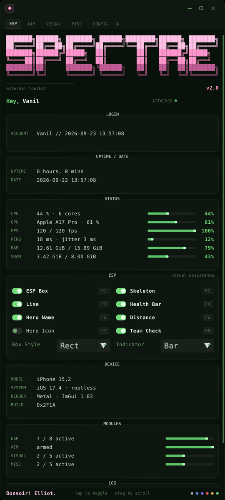
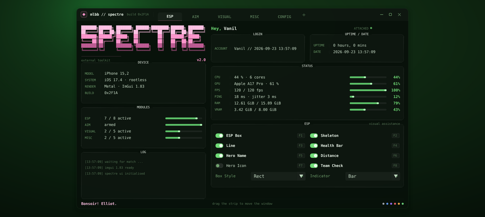
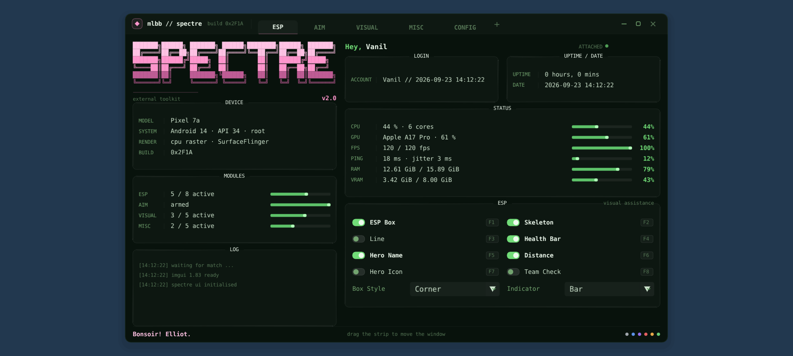

# mlbb — ImGui меню (SPECTRE)

Меню для Theos-твика: **ImGui 1.83**, тема — «тёмно-зелёный терминал» в стиле
fastfetch: полупрозрачное окно, розовый блочный баннер `SPECTRE`, секции с
заголовком на рамке, строки `ЛЕЙБЛ | значение` с барами, лог-консоль.

Запускается тремя способами:

* **окном на десктопе** — `make app` (SDL2 + софтверный рендер, никакого GPU);
* **окном на телефоне** — `./run.sh` (Termux + Termux:X11), тап = клик, свайп = прокрутка;
* **оверлеем поверх других приложений** — `./run.sh --overlay` (Android + root,
  без SDL, X11 и NDK: своя SurfaceFlinger-поверхность и чтение тача из `/dev/input`).

Плюс как **модуль внутри чужого ImGui-бэкенда** (в твике это `ImGuiDrawView.mm` + Metal).

> **Внутри нет никакого функционала.** Ни одного адреса, хука или обращения к
> игре — только UI. Все тумблеры/слайдеры/комбо хранят собственное состояние в
> `mlbb::Features`, чтобы виджетам было что показывать. Логика подключается
> снаружи (см. «Как добавить пункт»).

| десктоп / превью | телефон, портрет | телефон, ландшафт |
| --- | --- | --- |
|  |  |  |

## Запуск на телефоне (Android + Termux)

1. Поставить **Termux** (F-Droid) и приложение **Termux:X11** (APK с
   [github.com/termux/termux-x11/releases](https://github.com/termux/termux-x11/releases)) —
   это X-сервер, в его окне и живёт меню.
2. В Termux:

```bash
pkg install git
git clone https://github.com/babijon709-netizen/mlbb
cd mlbb
./run.sh
```

`run.sh` сам: поставит `clang make pkg-config sdl2`, подтянет ImGui
(`git submodule update --init --recursive`), соберёт `build/spectre`, поднимет
Termux:X11 и запустит меню на весь экран. Тап — клик, свайп — прокрутка.

```bash
./run.sh --tab 2 --populate      # сразу на вкладке VISUAL, часть тумблеров включена
./run.sh --windowed 900x600      # окном, не на весь экран
./run.sh --ui-scale 0.75         # крупнее интерфейс  (см. «Производительность»)
./run.sh --shot menu.ppm         # просто отрендерить кадр в картинку, окно не нужно
./run.sh --help                  # все флаги приложения
```

Без X11 (например, если Termux:X11 ставить не хотите) можно получить картинку:

```bash
./run.sh --shot menu.ppm && convert menu.ppm menu.png
```

## Оверлей поверх других приложений (root)

То же меню, но не окном, а **слоем поверх всего**: его можно включить прямо
поверх игры и кликать по нему.

```bash
./run.sh --overlay                     # собрать и повесить поверх всего
./run.sh --overlay --populate --tab 2  # сразу с включёнными тумблерами
```

Никакого APK, JNI и Android Studio — это один ELF:

1. `src/overlay/ANativeWindowCreator.h` создаёт слой прямо в SurfaceFlinger,
   вручную разбирая символы `libgui.so` / `libutils.so` (системный вызов, поэтому
   нужен root);
2. слой помечен `SetTrustedOverlay(true)` + `SetLayer(INT_MAX)` — он самый верхний
   и **не входит в дерево обработки ввода**: касания продолжают доходить до игры,
   а меню читает их само из `/dev/input` (`src/overlay/TouchReader.*`);
3. кадр рисует тот же софтверный растеризатор, а отдаётся он через
   `ANativeWindow_lock()` / `unlockAndPost()` — обычный CPU-производитель
   BufferQueue, как `lockCanvas()` у `SurfaceView`. Ни EGL, ни GLES, ни SDL здесь
   нет вообще;
4. буфер — premultiplied RGBA8888, поэтому прозрачные места меню действительно
   прозрачные: сквозь них видно игру.

Сборке нужны только `clang` и `make` — всё есть в Termux:

```bash
pkg install clang make
git clone https://github.com/babijon709-netizen/mlbb && cd mlbb
./run.sh --overlay
```



Управление: тап — клик, свайп — прокрутка (в компактной вёрстке) или перетаскивание
окна, `✕` в заголовке — выход, **Громкость+ и Громкость− вместе** — аварийный выход.

Если тап попадает не туда (панель бывает повёрнута относительно экрана — тогда
меню реагирует «по диагонали»):

```bash
./run.sh --overlay --debug-touch                 # крестик и координаты на экране
./run.sh --overlay --touch-swap --touch-mirror-x # или --touch-mirror-y / --touch-rot 90
```

Диагностика печатается в stdout и в logcat (тег `spectre`): uid, режим дисплея,
размер и формат поверхности, все найденные `/dev/input/event*` с диапазонами осей
и выбранное преобразование.

Полезные флаги:

| флаг | смысл |
| --- | --- |
| `--size WxH` | размер поверхности (по умолчанию весь экран) |
| `--grab` | забрать тач у игры, пока работает меню (по умолчанию касания идут и в игру) |
| `--no-exit-chord` | выключить выход по «громкость+ / громкость−» |
| `--shot FILE --shot-bg RRGGBB` | отрендерить один кадр в PPM прямо на телефоне или на ПК |

Чего ждать не стоит: слой помечен как trusted overlay, поэтому в **запись экрана и
скриншоты (MediaProjection) он не попадёт**, и в «недавних» его нет — система не
знает, что что-то запущено, выходить нужно крестиком или по громкости. Кнопок
`—` и `□` в заголовке это тоже касается: свернуть оверлей некуда, поэтому они
просто переключают состояние.

## Десктоп

```bash
sudo apt install libsdl2-dev        # Linux;  macOS: brew install sdl2 pkg-config
make app                            # -> build/spectre
./build/spectre                     # окно на весь экран
./build/spectre --windowed 1280x720
```

## Что где лежит

```
include/mlbb_gui/Menu.h      публичный API: Config, Fonts, Features, DrawMenu(), LoadFonts()
include/mlbb_gui/Theme.h     палитра, метрики, ASCII-арт, ApplyTheme()
src/Menu.cpp                 вся отрисовка меню (ImDrawList, без стоковых виджетов)
src/Theme.cpp                стиль ImGui + баннер и эмблема
src/app/main_sdl.cpp         приложение-окно: SDL2, ввод (мышь/тач/клавиатура), бэкдроп
src/app/main_overlay.cpp     оверлей: своя SurfaceFlinger-поверхность, /dev/input, кадры через ANativeWindow_lock
src/overlay/                 слой Android: создание поверхности + чтение тача + вывод кадров
src/overlay/ANativeWindowCreator.h  создание слоя в SurfaceFlinger (MIT, AFan4724/Qimgui, см. шапку файла)
src/render/SoftRenderer.*    софтверный растеризатор ImDrawData -> RGBA (общий для app и preview)
tools/preview/               отладочный рендерер меню в картинку (без окна и GPU)
assets/fonts/                DejaVu Sans Mono (+ Bold) — шрифт по умолчанию
run.sh                       сборка и запуск одной командой (телефон и десктоп)
Makefile                     make app / overlay / shot / run / clean
external/imgui               сабмодуль ocornut/imgui, пришпилен на тег v1.83
docs/preview/                скриншоты
```

## Как это устроено

* **Никакого GPU.** `SoftRenderer` рисует `ImDrawData` в обычный RGBA-буфер,
  `src/app` блитит его в оконную поверхность SDL. Поэтому оно работает и в
  Termux:X11, где аппаратного GL нет, и в CI, и на десктопе.
* **Плотность пикселей.** `Config::pixelDensity` — во сколько физических
  пикселей превращается один логический. Шрифты растрируются сразу в этом
  масштабе (`size * pixelDensity`), а меню продолжает раскладываться в
  логических единицах, поэтому на телефоне текст крупный **и** резкий, а не
  растянутый. `src/app` подбирает плотность сам так, чтобы меню почти
  заполняло экран.
* **Оверлей без APK.** На Android слой создаётся вызовом SurfaceFlinger, кадры
  уходят в него через `ANativeWindow_lock()`, а ввод читается из `/dev/input`:
  поэтому `src/overlay/*` не тянет ни NDK, ни EGL — файлы `ANativeWindowCreator.h`
  и `ndk_compat.h` заменяют собой заголовки NDK, а `libgui.so` / `libutils.so` /
  `libandroid.so` ищутся символами уже на устройстве.
* **Компактная вёрстка.** Если экран выше, чем шире, `src/app` включает
  `Config::compact`: окно занимает весь экран, а секции идут одной колонкой и
  прокручиваются свайпом (тонкий ползунок справа). Ландшафт и десктоп остаются
  двухколоночными.

## Подключение к ImGui (твик, Metal)

```cpp
#include "mlbb_gui/Menu.h"
#include "mlbb_gui/Theme.h"

// --- один раз после ImGui::CreateContext()
mlbb::theme::ApplyTheme();

mlbb::Config   cfg;      // размеры окна, тексты, пути к TTF
mlbb::Features feat;     // состояние всех виджетов
mlbb::Fonts    fonts = mlbb::LoadFonts(cfg);   // до первого кадра!

// --- каждый кадр, между ImGui::NewFrame() и ImGui::Render()
mlbb::DrawMenu(cfg, fonts, feat);

// --- когда нужно что-то записать в лог-консоль меню
mlbb::PushLog("match started: %s", heroName);
```

Шрифты: `cfg.fontRegular` / `cfg.fontBold` — пути к TTF (в комплекте лежит
DejaVu Sans Mono, он же используется в скриншотах). Окно само центрируется при
первом кадре, таскается за полосу вкладок (`ImGuiWindowFlags_NoMove` + свой
drag-хендлер). Кнопки в полосе: `—` свернуть, `□` разрешить ресайз, `✕` закрыть
(`feat.windowOpen = false`).

## Превью без устройства

```bash
git submodule update --init --recursive   # подтянуть ImGui v1.83
make -C tools/preview shot                # -> tools/preview/build/menu.png
```

`make shot` собирает `tools/preview/build/mlbb_preview` и рендерит меню
софтверным растеризатором — GPU, окно и устройство не нужны. Полезные флаги:

```bash
tools/preview/build/mlbb_preview \
  --out menu.ppm --display 1400x840 --height 680 \
  --tab 2 --populate --uptime 42 \
  --font /path/to/JetBrainsMono-Regular.ttf \
  --bold /path/to/JetBrainsMono-Bold.ttf
convert menu.ppm menu.png     # PPM -> PNG (ImageMagick)
```

| флаг | смысл |
| --- | --- |
| `--tab 0..4` | какую вкладку показать (ESP / AIM / VISUAL / MISC / CONFIG) |
| `--populate` | включить часть тумблеров, чтобы было видно оба состояния |
| `--uptime N` | сделать вид, что сессия идёт N минут |
| `--click X,Y` | синтетический клик — удобно проверять реакцию виджетов |
| `--folded` | показать свёрнутое окно (только заголовок) |
| `--bg file.ppm` | подложить фон (обои рабочего стола) |

## Флаги приложения

| флаг | смысл |
| --- | --- |
| `--window WxH` | окно заданного размера (`--windowed` = 1280x720) |
| `--density N` | масштаб кадра вручную; по умолчанию подбирается под экран |
| `--ui-scale N` | множитель к автоматической плотности (меньше — быстрее, но мягче) |
| `--compact` / `--wide` | заставить телефонную или десктопную вёрстку |
| `--menu WxH` | логический размер меню (1120x680; на телефоне 440) |
| `--tab N`, `--populate`, `--folded` | как в превью |
| `--frames N --out FILE` | отрендерить N кадров и сохранить кадр в PPM (можно без дисплея) |
| `--click X,Y` | синтетический клик в физических пикселях (для скриншотов) |
| `--fps N` | ограничение частоты кадров (0 — без ограничения, по умолчанию 60) |
| `--filter bilinear\|nearest` | фильтрация текстуры шрифта |

У оверлея свой набор (тач, размеры поверхности, отладочная калибровка):

```bash
./run.sh --overlay --help
```

Клавиши окна: `F1..F5` — вкладки, `F11` — полный экран, `F12` — скриншот
(`spectre-N.ppm`), `Esc` — выход.

## Производительность

Растеризация — на CPU, поэтому цена кадра линейна по числу пикселей:
на 1080x2400 «как есть» это ~80 мс/кадр на слабой машине и ~15-30 мс на
телефоне. Если хочется плавнее:

```bash
./run.sh --ui-scale 0.75     # 0.56x пикселей: заметно быстрее, чуть мягче текст
./run.sh --fps 30            # вдвое меньше работы и меньше расход батареи
```

`--ui-scale` умножается на автоматическую плотность, так что 0.75 — это
«на 25% мельче интерфейс и примерно вдвое легче кадр».

## Как добавить пункт

Всё содержимое вкладок — таблицы строк, верстка автоматическая (колонки,
перенос, высота секции считается по факту).

```cpp
const RowSpec kEspRows[] = {
    Toggle("ESP Box", &Features::espBox, "F1"),          // тумблер + хоткей
    Slider("Field of View", &Features::aimFov, 0.f, 360.f, "%.0f°"),
    Combo ("Hitbox", &Features::aimHitbox, kHitboxes, 3),
};
```

- `span` в `RowSpec` — сколько колонок занимает строка (например, кнопки
  CONFIG-вкладки растянуты на 4).
- Новая вкладка = запись в `kTabs[]` + ветка в `DrawTabContent()` и
  `TabContentHeight()`.
- Новая секция = функция вида `DrawDeviceSection()` и вызов из `DrawSidebar()`
  (широкая вёрстка) и из `DrawCompactBody()` (телефонная).

Каждый `Toggle/Slider/Combo` автоматически пишет строку в LOG
(`ESP Box enabled`, `Box Style -> Corner` и т.п.).

## Структура окна

```
┌─ полоса вкладок: логотип, название, билд, ESP AIM VISUAL MISC CONFIG +, — □ ✕
├─ левая колонка (420px)                 ├─ правая колонка (dashboard)
│  SPECTRE (ASCII, авто-масштаб)          │  Hey, Vanil + ATTACHED (пульс)
│  DEVICE / MODULES (строки с барами)     │  LOGIN + UPTIME / DATE
│  LOG (последние записи)                 │  STATUS (CPU/GPU/FPS/PING/RAM/VRAM)
│  эмблема (если осталось место)          │  активная вкладка
└─ футер: Bonsoir! Elliot. · подсказка · цветные точки
```

На телефоне в портрете всё то же самое, но одной колонкой:
`баннер → приветствие → LOGIN → UPTIME → STATUS → вкладка → DEVICE → MODULES → LOG`.

## Проверка совместимости

`src/Menu.cpp` и `src/Theme.cpp` собираются без изменений и против официального
ImGui v1.83 (`external/imgui`), и против ImGui из твика-референса (1.83 WIP):

```bash
g++ -std=c++17 -fsyntax-only -Iinclude -Iexternal/imgui src/Menu.cpp
```

## Лицензия

См. `LICENSE` (репозиторий использовал MIT). ImGui распространяется по своей
лицензии (MIT) — `external/imgui/LICENSE.txt`. `src/overlay/ANativeWindowCreator.h`
взят из [Qimgui](https://github.com/nmldy/Qimgui) /
[AndroidSurfaceImgui-Enhanced](https://github.com/AFan4724/AndroidSurfaceImgui-Enhanced)
(MIT, © AFan4724) — список правок в шапке файла. Шрифт DejaVu — свободная
лицензия Bitstream Vera/DejaVu, текст в `assets/fonts/LICENSE-DejaVu.txt`.
