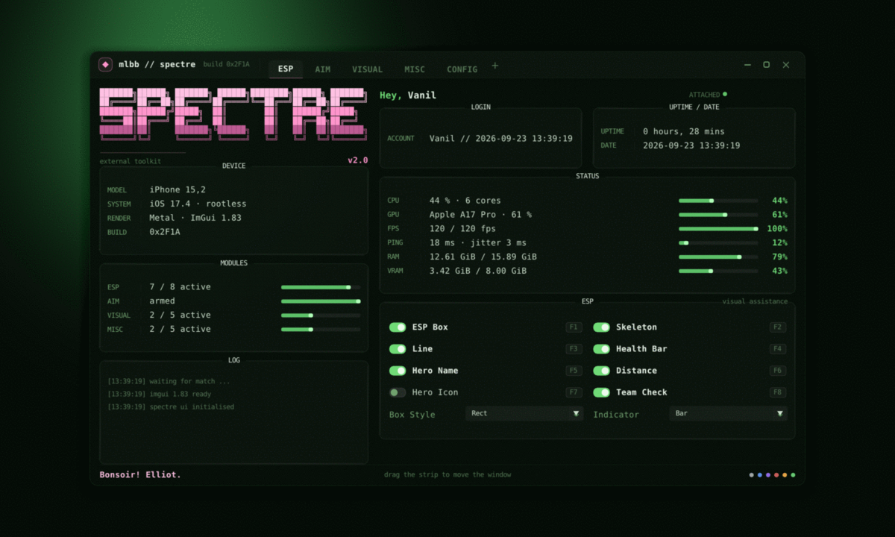

# mlbb — ImGui меню (SPECTRE)

Меню для Theos-твика: **ImGui 1.83 + Metal**, тема — «тёмно-зелёный терминал»
в стиле fastfetch: полупрозрачное окно, розовый блочный баннер `SPECTRE`,
секции с заголовком на рамке, строки `ЛЕЙБЛ | значение` с барами, лог-консоль.

> **Внутри нет никакого функционала.** Ни одного адреса, хука или обращения к
> игре — только UI. Все тумблеры/слайдеры/комбо хранят собственное состояние в
> `mlbb::Features`, чтобы виджетам было что показывать. Логика подключается
> снаружи (см. «Как добавить пункт»).



## Что где лежит

```
include/mlbb_gui/Menu.h      публичный API: Config, Fonts, Features, DrawMenu(), LoadFonts()
include/mlbb_gui/Theme.h     палитра, метрики, ASCII-арт, ApplyTheme()
src/Menu.cpp                 вся отрисовка меню (ImDrawList, без стоковых виджетов)
src/Theme.cpp                стиль ImGui + баннер и эмблема
tools/preview/               отладочный рендерер меню в картинку (без GPU и без окна)
external/imgui               сабмодуль ocornut/imgui, пришпилен на тег v1.83
docs/preview/                скриншоты
```

Своего `main`/точки входа нет — модуль встраивается в существующий ImGui-бэкенд
(в твике это `ImGuiDrawView.mm`, рендер через `imgui_impl_metal`):

```objc
// ImGuiDrawView.mm

// один раз, в -initWithNibName: после ImGui::CreateContext()
mlbb::theme::ApplyTheme();
mlbb::Config cfg;
cfg.fontRegular = "/path/in/bundle/JetBrainsMono-Regular.ttf";
mlbb::Fonts    fonts = mlbb::LoadFonts(cfg);   // до первого кадра
mlbb::Features feat;

// каждый кадр, в -drawInMTKView: между ImGui::NewFrame() и ImGui::Render()
mlbb::DrawMenu(cfg, fonts, feat);
```

Меню ничего не знает о бэкенде: на Android/десктопе вместо Metal просто
подставляется свой (`imgui_impl_android` / `imgui_impl_sdl` / …).

## Быстрый старт (превью без устройства)

```bash
git submodule update --init --recursive   # подтянуть ImGui v1.83
make -C tools/preview shot                # -> tools/preview/build/menu.png
```

`make shot` собирает `tools/preview/build/mlbb_preview` и рендерит меню
софтверным растеризатором (`SoftRenderer.cpp`) — GPU, окно и устройство не
нужны, подойдёт любой Linux/macOS. Полезные флаги:

```bash
tools/preview/build/mlbb_preview \
  --out menu.ppm --display 1400x840 --height 680 \
  --tab 2 --populate --uptime 42 \
  --font /path/to/JetBrainsMono-Regular.ttf \
  --bold /path/to/JetBrainsMono-Bold.ttf
convert menu.ppm menu.png     # PPM -> PNG (ImageMagick)
```

| флаг | смысл |
| --- | --- |
| `--tab 0..4` | какую вкладку показать (ESP / AIM / VISUAL / MISC / CONFIG) |
| `--populate` | включить часть тумблеров, чтобы было видно оба состояния |
| `--uptime N` | сделать вид, что сессия идёт N минут |
| `--click X,Y` | синтетический клик — удобно проверять реакцию виджетов |
| `--folded` | показать свёрнутое окно (только заголовок) |
| `--bg file.ppm` | подложить фон (обои рабочего стола) |

## Подключение к ImGui

```cpp
#include "mlbb_gui/Menu.h"
#include "mlbb_gui/Theme.h"

// --- один раз после ImGui::CreateContext()
mlbb::theme::ApplyTheme();

mlbb::Config   cfg;      // размеры окна, тексты, пути к TTF
mlbb::Features feat;     // состояние всех виджетов
mlbb::Fonts    fonts = mlbb::LoadFonts(cfg);   // до первого кадра!

// --- каждый кадр, между ImGui::NewFrame() и ImGui::Render()
mlbb::DrawMenu(cfg, fonts, feat);

// --- когда нужно что-то записать в лог-консоль меню
mlbb::PushLog("match started: %s", heroName);
```

Шрифты: `cfg.fontRegular` / `cfg.fontBold` — пути к TTF (например
JetBrains Mono, Iosevka). Если их не задать, берётся встроенный шрифт ImGui —
раскладка не поедет, но выглядеть будет менее «терминально». Диапазоны глифов
уже включают кириллицу, стрелки, рамки и блочные элементы (⠿ нужно для арта).

Окно само центрируется при первом кадре, таскается за полосу вкладок
(`ImGuiWindowFlags_NoMove` + свой drag-хендлер). Кнопки в полосе:
`—` свернуть, `□` разрешить ресайз, `✕` закрыть (`feat.windowOpen = false`).

## Как добавить пункт

Всё содержимое вкладок — таблицы строк, верстка автоматическая (колонки,
перенос, высота секции считается по факту).

```cpp
const RowSpec kEspRows[] = {
    Toggle("ESP Box", &Features::espBox, "F1"),          // тумблер + хоткей
    Slider("Field of View", &Features::aimFov, 0.f, 360.f, "%.0f°"),
    Combo ("Hitbox", &Features::aimHitbox, kHitboxes, 3),
};
```

- `span` в `RowSpec` — сколько колонок занимает строка (например, кнопки
  CONFIG-вкладки растянуты на 4).
- Новая вкладка = запись в `kTabs[]` + ветка в `DrawTabContent()` и
  `TabContentHeight()`.
- Новая секция на дашборде = `BeginSection()/Section::Row()` + `InfoRow()`.

Каждый `Toggle/Slider/Combo` автоматически пишет строку в LOG
(`ESP Box enabled`, `Box Style -> Corner` и т.п.).

## Структура окна

```
┌─ полоса вкладок: логотип, название, билд, ESP AIM VISUAL MISC CONFIG +, — □ ✕
├─ левая колонка (420px)                 ├─ правая колонка (dashboard)
│  SPECTRE (ASCII, авто-масштаб)          │  Hey, Vanil + ATTACHED (пульс)
│  DEVICE / MODULES (строки с барами)     │  LOGIN + UPTIME / DATE
│  LOG (последние записи)                 │  STATUS (CPU/GPU/FPS/PING/RAM/VRAM)
│  эмблема (если осталось место)          │  активная вкладка
└─ футер: Bonsoir! Elliot. · подсказка · цветные точки
```

## Проверка совместимости

`src/Menu.cpp` и `src/Theme.cpp` собираются без изменений и против официального
ImGui v1.83 (`external/imgui`), и против ImGui из твика-референса (1.83 WIP):

```bash
g++ -std=c++17 -fsyntax-only -Iinclude -Iexternal/imgui src/Menu.cpp
```

## Лицензия

См. `LICENSE` (репозиторий использовал MIT). ImGui распространяется по своей
лицензии (MIT) — `external/imgui/LICENSE.txt`.
